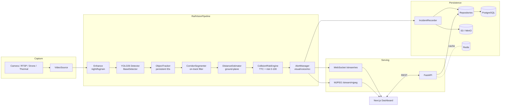

# Architecture

RailVision AI follows **Clean Architecture**: the domain pipeline depends on
abstractions, not frameworks. Detectors, storage and transport (HTTP/WS) are
replaceable details at the edges.

## System overview

## Layered design

| Layer | Modules | Depends on |
|---|---|---|
| **Domain / contracts** | `app.schemas` | nothing |
| **Use cases (pipeline)** | `detection.pipeline`, `detection.risk`, `tracking`, `segmentation`, `depth`, `alerts` | domain + interfaces |
| **Interfaces** | `ai.base.BaseDetector`, `database.repository` | domain |
| **Adapters** | `ai.yolo26_detector`, `ai.mock_detector`, `database.models`, `utils.video` | interfaces |
| **Frameworks / delivery** | `api.*`, `main`, Next.js | adapters via `container` |

The **composition root** (`app.container.Container`) is the *only* place that
constructs concrete implementations and wires them — keeping the rest of the
code free of `new`/import-time coupling (Dependency Injection).

## Key design decisions

- **`BaseDetector` abstraction (DIP).** YOLO26 is one implementation. Swap for
  ONNX Runtime, TensorRT, or the deterministic `MockDetector` without touching
  the pipeline. Enables the always-boots guarantee.
- **Pydantic contracts between stages.** Every stage consumes/produces typed
  `Detection` / `FrameResult` objects, so stages are independently testable and
  composable (Single Responsibility + Open/Closed).
- **Repository pattern.** The API/analytics depend on `IncidentRepository` /
  `StatsRepository`, never on SQLAlchemy — storage can evolve independently.
- **Stateful only where physics demands it.** The tracker and risk engine keep
  per-track history; everything else is a pure transform of the current frame.
- **Graceful degradation.** Missing weights → pretrained YOLO26 + COCO remap;
  missing AI stack → mock detector; missing Postgres → in-memory SQLite.

## Data flow per frame

1. `VideoSource` yields a BGR frame.
2. `auto_enhance` classifies the condition and applies a matching enhancer.
3. `Yolo26Detector.predict` returns raw `Detection`s.
4. `ObjectTracker.update` assigns persistent `track_id`s and foot-point history.
5. `CorridorSegmenter.is_on_track` flags detections inside the rail corridor.
6. `DistanceEstimator.estimate` computes metres for on-track objects.
7. `CollisionRiskEngine.assess` derives speed, TTC, risk score, alert level.
8. `AlertManager` computes the overall level + recommendation (+ voice cue).
9. `IncidentRecorder.maybe_record` persists an evidence bundle if threshold met.
10. `FrameResult` is emitted over WebSocket to the dashboard.

## Extensibility points

- **New detector**: implement `BaseDetector`, register in `ai.factory`.
- **New camera type** (thermal/drone/multi-cam): implement `VideoSource`.
- **New storage**: implement a repository; swap in `container`.
- **New enhancer**: add to `utils.enhancement.ENHANCERS`.
